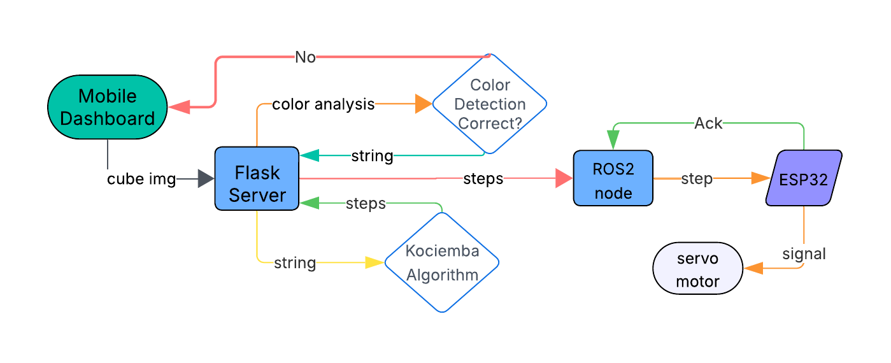
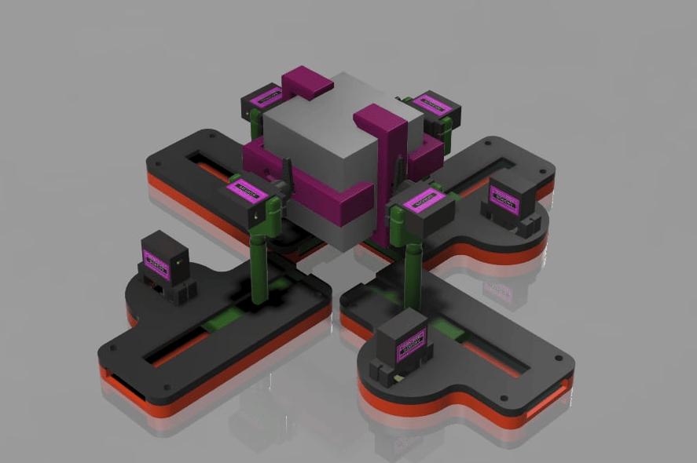

# Rubik's Cube Solver Robot

[](https://docs.ros.org/en/humble/)
[](https://www.python.org/)
[](https://flask.palletsprojects.com/)
[](LICENSE)

An automated Rubik's Cube solving system that uses computer vision for color detection, the Kociemba algorithm for solving, and ROS2 for robot control. The system features a web-based interface for capturing cube faces via camera and real-time solution publishing to hardware controllers.

---

## 📋 Table of Contents

- [Features](#-features)
- [System Architecture](#-system-architecture)
- [Hardware Setup](#-hardware-setup)
- [Project Structure](#-project-structure)
- [Installation](#-installation)
- [Usage](#-usage)
- [API Documentation](#-api-documentation)
- [ROS2 Integration](#-ros2-integration)
- [Development](#-development)
- [Troubleshooting](#-troubleshooting)
- [Contributing](#-contributing)
- [License](#-license)
- [Acknowledgments](#-acknowledgments)

---

## ✨ Features

- **🎥 Computer Vision-Based Detection**
  - HSV-based color detection optimized for cubes with black bases
  - Real-time preview with annotated sticker detection
  - Manual color correction interface

- **🧮 Fast Solving Algorithm**
  - Kociemba two-phase algorithm implementation
  - Optimal or near-optimal solutions (typically 20-25 moves)
  - Validates cube state before solving

- **🌐 Web Interface**
  - Mobile-friendly responsive design
  - Camera access for direct cube capture
  - Face-by-face upload workflow
  - Live solution visualization

- **🤖 ROS2 Integration**
  - Real-time solution publishing to `/cube_solution` topic
  - Compatible with ROS2 Humble and newer
  - Separate hardware control node for robot actuation

- **📊 Project Assets**
  - 3D printable robot parts (STL/STEP files)
  - Project reports and documentation
  - Setup images and diagrams

---

## 🏗️ System Architecture

### Block Diagram



### Component Overview

```
┌─────────────────────────────────────────────────────────────┐
│                        Web Browser                          │
│                     (Frontend UI)                           │
│              Camera → Upload → Preview → Solve              │
└────────────────────────┬────────────────────────────────────┘
                         │ HTTPS (Port 5000)
                         ▼
┌─────────────────────────────────────────────────────────────┐
│                    Flask Backend (app.py)                   │
│  ┌──────────────┐  ┌──────────────┐  ┌─────────────────┐  │
│  │   Color      │  │  Kociemba    │  │   ROS2 Bridge   │  │
│  │  Detector    │→ │   Solver     │→ │   Publisher     │  │
│  └──────────────┘  └──────────────┘  └─────────────────┘  │
└────────────────────────────────────────────┬────────────────┘
                                             │ ROS2 Topic
                                             ▼
┌─────────────────────────────────────────────────────────────┐
│              ROS2 /cube_solution Topic                      │
│                   (std_msgs/String)                         │
└────────────────────────────┬────────────────────────────────┘
                             │
                             ▼
┌─────────────────────────────────────────────────────────────┐
│            Hardware Controller Node (Optional)              │
│         Translates moves → Motor commands → Robot           │
└─────────────────────────────────────────────────────────────┘
```

### Technology Stack

| Layer | Technology |
|-------|------------|
| **Frontend** | HTML5, CSS3, Vanilla JavaScript |
| **Backend** | Python 3.8+, Flask 2.0+ |
| **Computer Vision** | OpenCV, NumPy |
| **Solver** | Kociemba Algorithm (python library) |
| **Middleware** | ROS2 Humble (rclpy, std_msgs) |
| **Hardware** | Arduino (cube_controller firmware) |

---

## 🔧 Hardware Setup

### Physical Setup



### Components Required

- **Microcontroller:** Arduino Uno/Mega or compatible board
- **Motors:** 6× Servo motors or stepper motors for face rotation
- **Structure:** 3D-printed frame (files in `assets/3d_parts/`)
- **Camera:** Any USB/built-in camera or smartphone
- **Power Supply:** 5V/12V depending on motor specifications
- **Wiring:** Jumper wires, breadboard, motor drivers (if using steppers)

### 3D Printed Parts

All mechanical parts are available in `assets/3d_parts/`:
- Motor mounts
- Cube holder frame
- Gripper mechanisms
- Base plate

Print settings: 0.2mm layer height, 20% infill, PLA or PETG material.

---

## 📁 Project Structure

```
cube_solver_workspace/
├── assets/                      # Project assets
│   ├── 3d_parts/               # 3D models (STL, STEP)
│   ├── images/                 # Project images and diagrams
│   │   ├── block_diagram.png
│   │   └── final_setup.png
│   └── reports/                # Documentation and reports
├── backend/                     # Flask web server
│   ├── app.py                  # Main Flask application
│   ├── color_detector.py       # Computer vision module
│   ├── kociemba_utils.py       # Cube solver wrapper
│   ├── requirements.txt        # Python dependencies
│   └── uploads/                # Uploaded face images
├── docs/                        # Documentation
│   ├── app.md                  # Backend API documentation
│   ├── color_detector.md       # Color detection module docs
│   ├── kociemba_utils.md       # Solver module docs
│   └── cube_solver_node.md     # ROS2 node documentation
├── firmware/                    # Arduino firmware
│   └── cube_controller/
│       └── cube_controller.ino # Motor control code
├── frontend/                    # Web interface
│   ├── index.html              # Main landing page
│   ├── upload.html             # Face upload interface
│   ├── css/
│   │   └── style.css
│   └── js/
│       └── main.js
├── src/                         # ROS2 package
│   └── cube_solver/
│       ├── package.xml
│       ├── setup.py
│       └── cube_solver/        # ROS2 Python nodes
└── README.md                    # This file
```

---

## 🚀 Installation

### Prerequisites

- **Operating System:** Ubuntu 22.04 (recommended) or compatible Linux
- **Python:** 3.8 or higher
- **ROS2:** Humble Hawksbill or newer
- **Node.js:** Optional (for frontend development tools)

### Step 1: Clone Repository

```bash
git clone https://github.com/5S4D1/cube_solver_workspace.git
cd cube_solver_workspace
```

### Step 2: Install System Dependencies

```bash
# Update system packages
sudo apt update && sudo apt upgrade -y

# Install Python and pip
sudo apt install python3 python3-pip -y

# Install OpenCV dependencies
sudo apt install libopencv-dev python3-opencv -y

# Install ROS2 Humble (if not already installed)
# Follow: https://docs.ros.org/en/humble/Installation.html
```

### Step 3: Install Python Dependencies

```bash
cd backend
pip install -r requirements.txt
```

**requirements.txt includes:**
```
flask>=2.0.0
flask-cors>=3.0.0
kociemba>=1.2.0
opencv-python>=4.5.0
numpy>=1.21.0
pyopenssl>=21.0.0
rclpy
```

### Step 4: Source ROS2 Environment

```bash
source /opt/ros/humble/setup.bash
```

Add to your `~/.bashrc` for persistence:
```bash
echo "source /opt/ros/humble/setup.bash" >> ~/.bashrc
```

### Step 5: Build ROS2 Package (Optional)

If you plan to use the ROS2 subscriber node:

```bash
cd ~/cube_solver_workspace
colcon build --packages-select cube_solver
source install/setup.bash
```

### Step 6: Upload Arduino Firmware (If Using Hardware)

1. Open `firmware/cube_controller/cube_controller.ino` in Arduino IDE
2. Connect your Arduino board
3. Select the correct board and port
4. Upload the firmware

---

## 🎯 Usage

### Quick Start

#### 1. Start the Flask Server

```bash
cd backend
python app.py
```

Server will start at `https://0.0.0.0:5000`

**Note:** HTTPS is required for camera access. You'll see a self-signed certificate warning — accept it to proceed.

#### 2. Access Web Interface

Open your browser and navigate to:
```
https://<your-ip-address>:5000
```

Or on the same machine:
```
https://localhost:5000
```

#### 3. Capture Cube Faces

1. Click "Upload Cube Faces" or navigate to `/upload.html`
2. For each face (U, R, F, D, L, B):
   - Use camera to capture the face
   - Ensure good lighting and center the cube
   - Upload the image
3. Review detected colors (shown with overlays)
4. Manually correct any misdetected colors if needed

#### 4. Solve the Cube

1. Click "Solve Cube" button
2. Backend will:
   - Detect all face colors
   - Validate cube state
   - Compute optimal solution
   - Publish to ROS2 `/cube_solution` topic
3. View solution moves on screen

#### 5. Execute Solution (With Hardware)

If you have the robot hardware connected:
- The solution is automatically published to ROS2
- Your hardware controller node receives the moves
- Robot executes the solution

---

## 📚 API Documentation

### Core Endpoints

| Endpoint | Method | Description |
|----------|--------|-------------|
| `/` | GET | Serve main landing page |
| `/upload_face` | POST | Upload single face image |
| `/get_detected_colors?face=U` | GET | Get 3×3 color grid for a face |
| `/solve_cube` | POST | Run full detection → solve → publish pipeline |
| `/manual_solve` | POST | Submit corrected colors or custom cube string |
| `/publish_solution` | POST | Directly solve and publish a cube string |

### Example: Manual Solve with cURL

```bash
curl -X POST https://localhost:5000/manual_solve \
  -H "Content-Type: application/json" \
  -d '{
    "cube_string": "UUUUUUUUURRRRRRRRFFFFFFFFFDDDDDDDDDLLLLLLLLLBBBBBBBBB"
  }'
```

**Response:**
```json
{
  "status": "success",
  "solution": "R U R' U' F2 D B' L2 ..."
}
```

For complete API documentation, see [`docs/app.md`](docs/app.md).

---

## 🤖 ROS2 Integration

### Published Topics

| Topic | Type | Description |
|-------|------|-------------|
| `/cube_solution` | `std_msgs/String` | Solution move sequence (e.g., "R U R' U'") |

### Subscribing to Solutions

Create a simple subscriber:

```python
import rclpy
from rclpy.node import Node
from std_msgs.msg import String

class SolutionListener(Node):
    def __init__(self):
        super().__init__('solution_listener')
        self.subscription = self.create_subscription(
            String,
            '/cube_solution',
            self.solution_callback,
            10)

    def solution_callback(self, msg):
        self.get_logger().info(f'Received solution: {msg.data}')
        # Parse and execute moves here

def main():
    rclpy.init()
    node = SolutionListener()
    rclpy.spin(node)
    node.destroy_node()
    rclpy.shutdown()

if __name__ == '__main__':
    main()
```

Run:
```bash
python3 solution_listener.py
```

For ROS2 node details, see [`docs/cube_solver_node.md`](docs/cube_solver_node.md).

---

## 🛠️ Development

### Running Tests

```bash
# Backend unit tests
cd backend
pytest test_solver.py

# Color detector tests
pytest test_color_detector.py
```

### Adding New Features

1. **Backend:** Add routes to `backend/app.py`
2. **Frontend:** Modify `frontend/index.html` or `frontend/js/main.js`
3. **Computer Vision:** Tune HSV ranges in `backend/color_detector.py`
4. **ROS2:** Add nodes to `src/cube_solver/cube_solver/`

### Logging

Enable debug logging:

```python
import logging
logging.basicConfig(level=logging.DEBUG)
```

Or configure in your application before importing modules:

```python
logging.getLogger('backend.color_detector').setLevel(logging.DEBUG)
```

---

## 🐛 Troubleshooting

### Issue: Camera not accessible in browser

**Solution:** Ensure you're accessing the site via HTTPS (not HTTP). Modern browsers require secure context for camera access.

---

### Issue: "Invalid cube state" error

**Cause:** Detected colors don't form a valid solvable cube.

**Solutions:**
- Check detected colors using annotated `*_detected.jpg` images in `backend/uploads/`
- Improve lighting conditions
- Use manual correction via `/manual_solve` endpoint
- Ensure each color appears exactly 9 times in the 54-sticker cube

---

### Issue: ROS2 topic not receiving messages

**Checklist:**
1. Ensure ROS2 is sourced: `source /opt/ros/humble/setup.bash`
2. Check topic exists: `ros2 topic list`
3. Echo the topic: `ros2 topic echo /cube_solution`
4. Verify Flask backend doesn't show ROS2 errors in console

---

### Issue: Self-signed certificate warnings

**Solution for Development:**
Accept the warning in your browser, or generate a trusted local certificate:

```bash
# Using mkcert (install from https://github.com/FiloSottile/mkcert)
mkcert -install
mkcert localhost 127.0.0.1 ::1
```

Then modify `app.py` to use the generated certificates:
```python
app.run(host='0.0.0.0', port=5000, debug=True, 
        ssl_context=('localhost+2.pem', 'localhost+2-key.pem'))
```

---

### Issue: Colors detected incorrectly (red vs orange, white vs yellow)

**Solutions:**
- Adjust HSV ranges in `color_detector.py` (`HSV_RANGES` dictionary)
- Improve lighting (diffuse white light recommended)
- Ensure cube is centered in frame
- Use manual color correction feature in frontend

See [`docs/color_detector.md`](docs/color_detector.md) for HSV tuning guide.

---

## 📖 Documentation

Detailed documentation for each component:

- **[Backend API (app.py)](docs/app.md)** — Complete API reference, deployment guide
- **[Color Detection (color_detector.py)](docs/color_detector.md)** — Computer vision implementation, HSV tuning
- **[Cube Solver (kociemba_utils.py)](docs/kociemba_utils.md)** — Solver wrapper, algorithm details
- **[ROS2 Node (cube_solver_node)](docs/cube_solver_node.md)** — Hardware integration, node setup

---

## 🤝 Contributing

We welcome contributions! Here's how you can help:

1. **Fork the repository**
2. **Create a feature branch:** `git checkout -b feature/my-new-feature`
3. **Make your changes** and add tests
4. **Update documentation** if needed
5. **Commit your changes:** `git commit -am 'Add new feature'`
6. **Push to the branch:** `git push origin feature/my-new-feature`
7. **Submit a Pull Request**

### Code Style

- **Python:** Follow PEP 8, use `black` formatter
- **JavaScript:** Use ES6+, consistent indentation
- **Documentation:** Update relevant `.md` files in `docs/`

---

## 📄 License

This project is licensed under the MIT License - see the [LICENSE](LICENSE) file for details.

---

## 🙏 Acknowledgments

- **Kociemba Algorithm:** Herbert Kociemba for the two-phase cube solving algorithm
- **Python Kociemba Library:** [kociemba on PyPI](https://pypi.org/project/kociemba/)
- **OpenCV Community:** For computer vision tools and resources
- **ROS2 Community:** For robotics middleware and documentation
- **Contributors:** Thank you to all who have contributed to this project!

---

## 📬 Contact

**Maintainer:** Sadi  
**Email:** shaklinesadi045@gmail.com  
**Repository:** [github.com/5S4D1/cube_solver_workspace](https://github.com/5S4D1/cube_solver_workspace)

---

## 🔗 Quick Links

- [Installation Guide](#-installation)
- [Usage Instructions](#-usage)
- [API Documentation](docs/app.md)
- [Troubleshooting](#-troubleshooting)
- [3D Parts](assets/3d_parts/)
- [Project Reports](assets/reports/)

---

**⭐ If you find this project useful, please star the repository!**

---

*Last Updated: November 2025*
